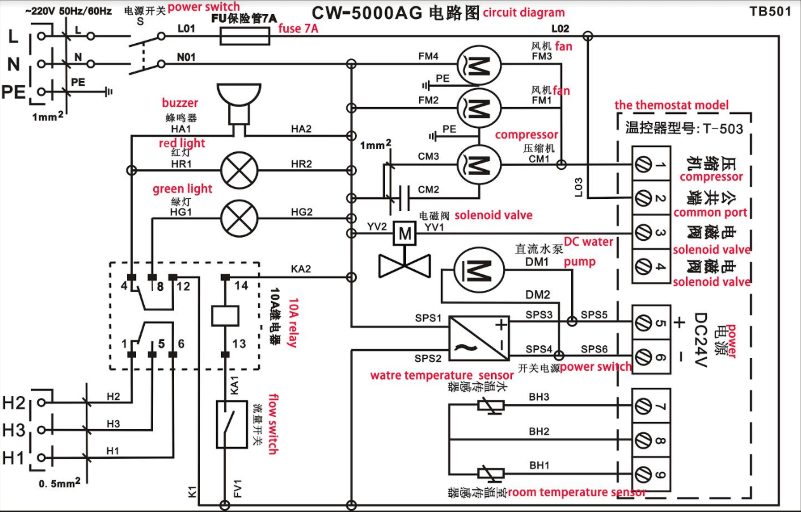
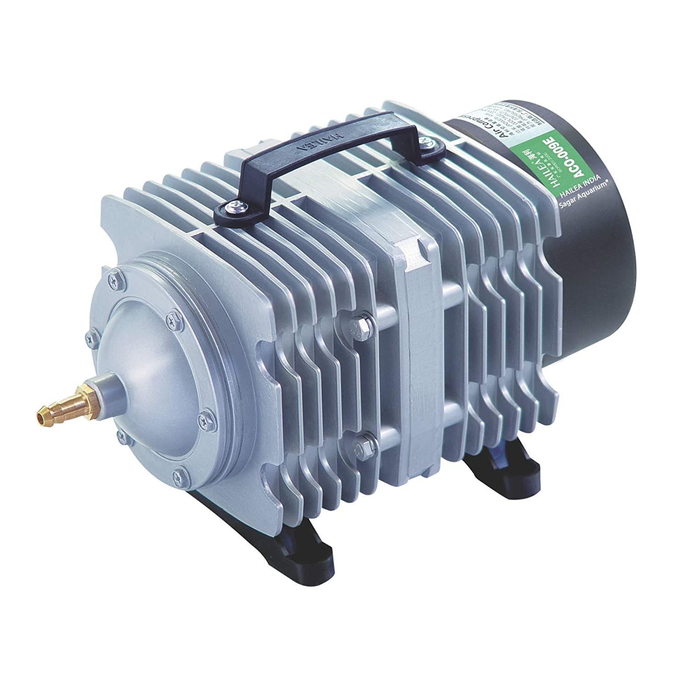
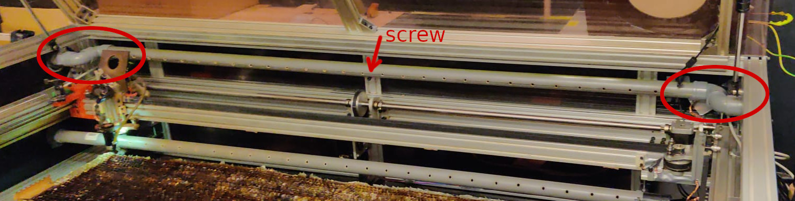
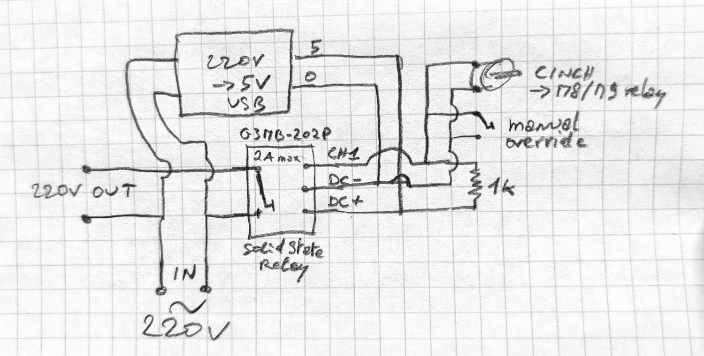
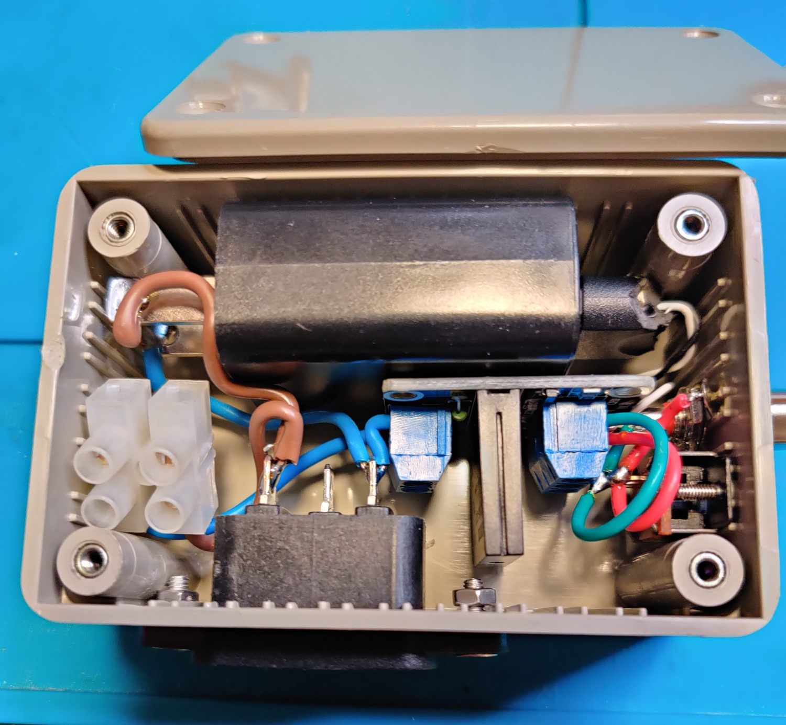
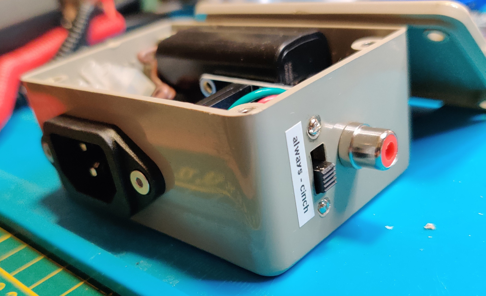
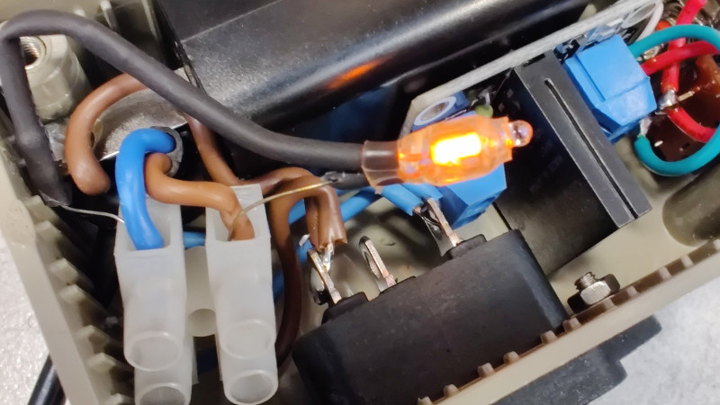
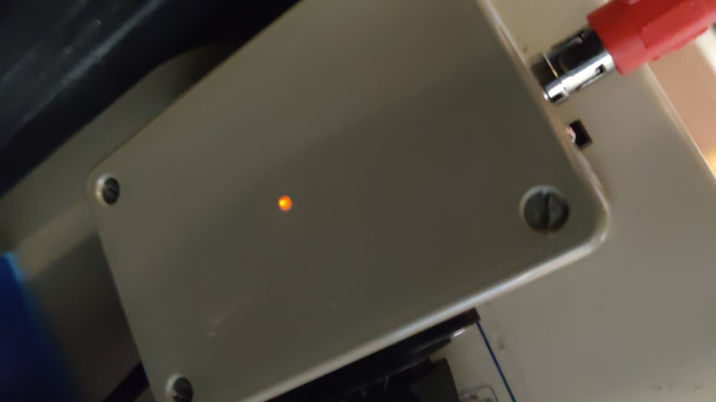
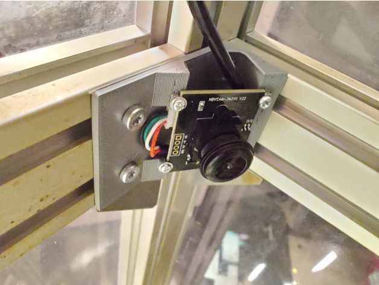

# Documentation

## Original lasersaur

* [Lasersaur](http://www.lasersaur.com/)
* [Lasersaur on Github](https://github.com/nortd/lasersaur)
* [Lasersaur manual](https://github.com/nortd/lasersaur/wiki)
* [Lasersaur Software](https://github.com/nortd/lasersaur/wiki/software)
* [Software Mods to the Lasersaur](https://theshamblog.com/software-mods-to-the-lasersaur/)
* [DriveboardApp](https://github.com/scottshambaugh/driveboardapp) is the official app to control Driveboard-based CNC machines like the Lasersaur.


## Chiller: CW-5000AG

* [S&W CW-5000 Series Chiller User Manual](https://support.thunderlaserusa.com/support/solutions/articles/65000066181-s-w-cw-5000-series-chiller-user-manual)
* [S&W CW-5000 Series Chiller Maintenance Manual](https://support.thunderlaserusa.com/support/solutions/articles/65000132633-s-w-cw-5000-series-chiller-maintenance-manual)
* [Chiller Diagnostics & Theory Of Operation](https://support.thunderlaserusa.com/support/solutions/articles/65000174472-chiller-diagnostics-theory-of-operation)
* [CW-5000AG Wiring Diagram](https://support.thunderlaserusa.com/support/solutions/articles/65000169349-cw-5000ag-wiring-diagram)
* [CW-5xxx Series Chiller Alarm Connections](https://support.thunderlaserusa.com/support/solutions/articles/65000166455-cw-5xxx-series-chiller-alarm-connections)
* [Constant Mode Temperature Set Point on CW-5XXX Chillers](https://support.thunderlaserusa.com/support/solutions/articles/65000150681-constant-mode-temperature-set-point-on-cw-5xxx-chillers)
* [Selecting Intelligent or Constant Mode on CW-5000 Series Chillers](https://support.thunderlaserusa.com/support/solutions/articles/65000150518-selecting-intelligent-or-constant-mode-on-cw-5000-series-chillers)
* [Identifying Counterfeit S&A Chillers](https://support.thunderlaserusa.com/support/solutions/articles/65000166456-identifying-counterfeit-s-a-chillers)
* [DC Tube Mode Hopping Due To Coolant Temp & Flow](https://support.thunderlaserusa.com/support/solutions/articles/65000174496-dc-tube-mode-hopping-due-to-coolant-temp-flow)



# Air assist: Hailea ACO-009E

* 180W
* 145L/min



# Fume extractor: BOFA AD Oracle IQ

https://bofainternational.com/en/find-products/extraction-systems/results/ad-oracle-iq/

* [Manuel (fr) (pdf)](img/AD-Oracle-iQ-Manuel-utilisateur-FR-Engravlaser.pdf)

Signal cable input at the back is configured to expect a 24V signal as enabler, so it's directly connected to the Openbuilds 24V power supply.
# Lasersaur 14.03 wiring

All wirings are done with RJ45 cables. RJ45 can be wired 568A, 568B or crossed, but lasersaur combines 2 wires such that it doesn't matter and any RJ45 (with proper shielding and copper section) will do.

## Limit switches

4 NC switches, 2 on X, 2 on Y.  
Limit reached => open.  
Put both X limit switches in series => "X-limit" on Openbuilds. Same for Y.

|Vcc|Sig|
|---|---|
|WG+WO|G+O|
|1+3|2+6|

Limit switches are very sensitive to EM perturbations when the laser fires. It's mostly visible when in raster mode (more on/off events) -> job interrupted by alarm.

How to avoid it:
* Use only shielded cables
* Ground shields on controller side
* Twist parts of cable which are not shielded
* Add copper strip to shield parts of cable which are not shielded (and ground it if possible)
* In GRBL, use `ENABLE_SOFTWARE_DEBOUNCE`

## Door switches, eStop

3 NO switches: left, right, eStop.  
Door need to be closed for switch to be closed.  
Put all 3 switches in series => "door" on Openbuilds.

|Vcc|Sig|
|---|---|
|WG+WO|G+O|
|1+3|2+6|

## Chiller

|Vcc|Sig|
|---|---|
|WG+WO|G+O|
|1+3|2+6|
|H3|H1|

H2 unused

H1+H3: closed = ok, open = alarm

Can be also put in series with door switches and eStop.

## X stepper 

|A|A'|B|B'|Model|
|-|--|-|--|-----|
|WG+WO|G+O|Bl+Br|WBl+WBr|
|1+3|2+6|4+8|5+7|
|Orange|Brown|Red|Yellow|Nanotech ST4118M1206 1.2A
|Red|Blue|Black|Green|42HS4013A4 1.3A (*)

(*) Ad-hoc replacement of the stepper after destruction of the Nanotech

## Y stepper 

|A|A'|B|B'|Model|
|-|--|-|--|-----|
|WG+WO|G+O|Bl+Br|WBl+WBr|
|1+3|2+6|4+8|5+7|
|Green|Black|Red|Blue|Nanotech ST5918M3008 3A

Moreover on the Nanotech motor, there are shortcuts to be made:

* Red-White with Blue-White
* Black-White with Green-White

## Stepper current

With the original lasersaur controller, stepper current is controlled by a resistor. $R(k\Omega)=\frac{47*I}{7-I} \Leftrightarrow I=\frac{7*R}{R+47}$
* X: $6k\Omega \Rightarrow 800mA$
* Y: $10k\Omega \Rightarrow 1200mA$

With Openbuilds controller, set stepper current potentiometers to the minimum!! By default Openbuilds stepper current potentiometers were at mid-range and burned a 1.2A stepper!

## Laser

Beware of RJ45 cable version, wirings are not redundant

|5V|TH/H|TL/L|WP/P|GND/G|IN|unused|unused|Comment|
|--|----|----|----|-----|--|------|------|-------|
|1|2|3|4|5|6|
|*| | | | |*|||Jumper 5V-IN
| |PWM| |DIS|GND||Vcc|Aux2|
| |Bl | |G+O|WBr+Br||WG+WO|WBl
| |4  | |2+6|7+8||1+3|5

WP alarm needs to be grounded for laser to work.

## Air assist

not wired on the original lasersaur controller.

|AirAssist+|GND|GND|Aux1Assist+|
|----------|---|---|-----------|
|WG+WO|G+O|Bl+Br|WBl+WBr|
|1+3|2+6|4+8|7+5|

# Replacing controller by GRBL-compatible controller

## [Openbuilds](../openbuilds/README.md)

We're wiring the lasersaur hardware to an **OpenBuilds BlackBox Motion Control System**. Firmware will be a vanilla GRBL 1.1h with our `config.h`.

Steps empirically measured:
* X: 71.03 steps/mm
* Y: 72.72 steps/mm

Set stepper current potentiometers to the minimum!! By default Openbuilds stepper current potentiometers were at mid-range and burned a 1.2A stepper!

Limit switches are NC and were connected to Vcc-Sig, but on the BlackBox it needs to connect to GND-Sig and be inverted as GRBL expects NO (except Z not connected = NO)

Only one input for 2 limit switches on the same axe. We wire our NC switches in *series* and we'll use `LIMITS_TWO_SWITCHES_ON_AXES`.

## Config

See https://github.com/doegox/grbl/tree/lasersaur_openbuilds

Closest OpenBuild FW is 2-axis but we tune it:

* we move to 1.1h (as commit https://github.com/gnea/grbl/commit/cc4c0ffebc5a9ad079cbb583650a4182def28bdb seems important)
* we define `LIMITS_TWO_SWITCHES_ON_AXES` such that it refuses to home if already homed
* This requires *all* limits to be ok including the non-existent Z limit -> `INVERT_LIMIT_PIN_MASK ((1<<X_LIMIT_BIT)|(1<<Y_LIMIT_BIT))` (and `DEFAULT_INVERT_LIMIT_PINS 0`)
* we choose homing X & Y at same time: `HOMING_CYCLE_0 ((1<<X_AXIS)|(1<<Y_AXIS))`
* we use the door as Safety Door but it's a NO switch, let's invert it: `INVERT_CONTROL_PIN_MASK (1<<CONTROL_FEED_HOLD_BIT)`
* Feed Hold -> Safety Door: `ENABLE_SAFETY_DOOR_INPUT_PIN`
* to avoid some false alarms on limits: `ENABLE_SOFTWARE_DEBOUNCE`

Initial settings:
```
#define DEFAULT_X_STEPS_PER_MM 71.030
#define DEFAULT_Y_STEPS_PER_MM 72.720
#define DEFAULT_Z_STEPS_PER_MM 250.0
#define DEFAULT_X_MAX_RATE 5000.0 // mm/min
#define DEFAULT_Y_MAX_RATE 5000.0 // mm/min
#define DEFAULT_Z_MAX_RATE 5000.0 // mm/min
#define DEFAULT_X_ACCELERATION (150.0*60*60) // 10*60*60 mm/min^2 = 10 mm/sec^2
#define DEFAULT_Y_ACCELERATION (150.0*60*60) // 10*60*60 mm/min^2 = 10 mm/sec^2
#define DEFAULT_Z_ACCELERATION (150.0*60*60) // 10*60*60 mm/min^2 = 10 mm/sec^2
#define DEFAULT_X_MAX_TRAVEL 1220.0 // mm NOTE: Must be a positive value.
#define DEFAULT_Y_MAX_TRAVEL 615.0 // mm NOTE: Must be a positive value.
#define DEFAULT_Z_MAX_TRAVEL 200.0 // mm NOTE: Must be a positive value.
#define DEFAULT_SPINDLE_RPM_MAX 1000.0 // rpm
#define DEFAULT_SPINDLE_RPM_MIN 0.0 // rpm
#define DEFAULT_STEP_PULSE_MICROSECONDS 10
#define DEFAULT_STEPPING_INVERT_MASK 0
#define DEFAULT_DIRECTION_INVERT_MASK 0
#define DEFAULT_STEPPER_IDLE_LOCK_TIME 255 // msec (0-254, 255 keeps steppers enabled)
#define DEFAULT_STATUS_REPORT_MASK 0 // WPos enabled (Lightburn needs $10=0)
#define DEFAULT_JUNCTION_DEVIATION 0.02 // mm
#define DEFAULT_ARC_TOLERANCE 0.002 // mm
#define DEFAULT_REPORT_INCHES 0 // false
#define DEFAULT_INVERT_ST_ENABLE 1 // true
#define DEFAULT_INVERT_LIMIT_PINS 0 // false
#define DEFAULT_SOFT_LIMIT_ENABLE 0 // false
#define DEFAULT_HARD_LIMIT_ENABLE 1  // true
#define DEFAULT_INVERT_PROBE_PIN 0 // false
#define DEFAULT_LASER_MODE 1 // true
#define DEFAULT_HOMING_ENABLE 1  // true
#define DEFAULT_HOMING_DIR_MASK 1 // homing towards left/rear
#define DEFAULT_HOMING_FEED_RATE 100.0 // mm/min
#define DEFAULT_HOMING_SEEK_RATE 3000.0 // mm/min
#define DEFAULT_HOMING_DEBOUNCE_DELAY 250 // msec (0-65k)
#define DEFAULT_HOMING_PULLOFF 4.0 // mm
```

## Flash a new GRBL

```avrdude -c arduino -P /dev/ttyUSB0 -b 115200 -p atmega328p -B 10 -U flash:w:grbl.hex:i```

or just

```make flash```

## Setup

Terminal:
`sudo minicom -s`
* Serial port setup:
  * A /dev/ttyUSB0
  * E 115200 8N1
  * F disable hw
* Screen and keyboard:
  * Q local echo on
* Save setup as default
* Exit minicom

`minicom -D /dev/ttyUSB0`

After reflash, reset EEPROM with `$RST=$` to use firmware values and define the machine name, e.g. `$I=lasersaur`.

Homing is in the rear-left corner (-1196:-4 mm) and we want it to be `0:615` so front-left is `0:0` and workspace is in the positive quadrant.

If unconfigured, this can be reenabled with:
```
$H ; Homing
G10 P1 L20 X0 Y615 ; Set new work offsets for G54
```
Should be the same as
```
G10 P1 L2 X0 Y-615 ; Set new work offsets for G54
```
G10 L20 is similar to G10 L2, except that instead of setting the offset/entry to the given value, it is set to a calculated value that makes the current coordinates become the given value.

## Homing

When homing is done on both axes, sometimes the cable guide is crashing into the fume extractor pipe.

One way to avoid the issue is to home X then Y and avoid the top middle area of the workbench:
  * `HOMING_CYCLE_0 (1<<X_AXIS)`
  * `HOMING_CYCLE_1 (1<<Y_AXIS)`

To solve permanently the problem, we pushed the fume extractor pipe further away.

Pipes are not glued to allow easy dismantling but beware to add a screw in the middle to avoid the pipe to shift down and obstruct the laser !!!



With this configuration, homing can again be done on both axes simultaneously.
## Air assist

OpenBuilds BlackBox Motion Control System has an internal Relay Mode jumper. We'll set it on M8/M9 so we can wire air assist to it and control it via M8 and M9 gcodes.

Relay cannot drive 220V, so we add intermediate circuitry to control ACO-009E power supply.

It's using a solid state relay OMRON G3MB-202P. It expects a trigger low, so we add a 1k pull-up and the Openbuilds relay will connect `CH1` to `DC-` (GND).
We integrate a small 5V USB power supply.


A switch allows to manually override the relay and activate unconditionally the compressor.

At first, the solid state relay didn't work properly but just measuring the output with a voltmeter made it work fine! So we added a small neon bulb to the output as a small resistive load. It's unclear why the compressor alone as load is not enough to get the relay conducting, maybe because it's a pure reactive load?



## Laser

* Laser TH(2) and GND(5) to Toolhead PWM(2) and GND(1)
* Laser WP(4) was shortcut to GND(5) => we connect it to door left switch for extra security and we'll connect it in series to Water Pump alarm once it's stable.

## Lightburn

### Configuration

* cf https://lightburnsoftware.github.io/NewDocs/CommonGrblSetups.html
* Add msg to remind about air assist and fume extractor (edit machine / edit job list + enable it)
* device settings: Enable $J jogging

### Door

Discussion ongoing https://forum.lightburnsoftware.com/t/lightburn-doesnt-seem-to-handle-unresponsive-grbl-interface-when-on-hold-or-door/62623

For now, door detector has been removed, the Openbuilds controller doesn't see anymore when the door is open.
Still, there is the secondary security on laser: the second door detector is wired to the laser WP itself, so the job continues but the laser stops firing.

### Camera



We added an OV3660 module with 110° field to integrate it in LightBurn and cover the entire workspace of a Lasersaur.

The mount is available as STL and Openscad source on Thingiverse: https://www.thingiverse.com/thing:5377499.

The OV3660 module came from Aliexpress (e.g. https://www.aliexpress.com/item/1005003937144930.html) and is now integrated with Lightburn software (cf https://lightburnsoftware.github.io/NewDocs/UsingACamera.html
)


## TODO:
* git save lightburn config
* material list, start from https://support.thunderlaserusa.com/support/solutions/articles/65000151932-100-watt-materials-libraries ?
