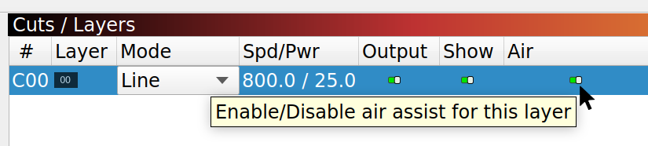
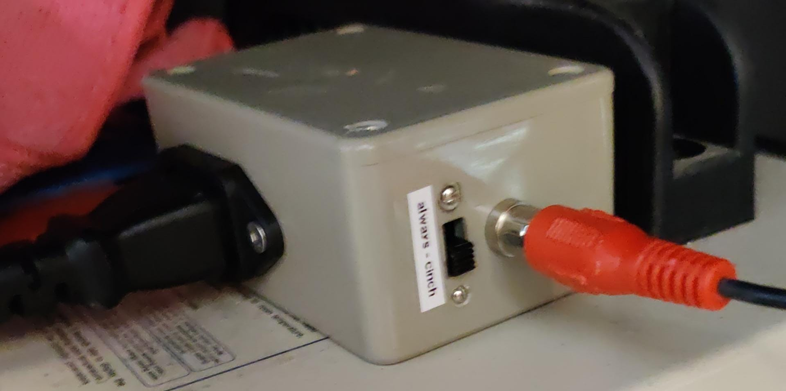

Make sure to open the USB port in one single application at once!!

## Homing

Make sure to always home first!!

Homing is in the rear-left corner and we want it to be 0,615 so front-left is 0,0 and workspace is in the positive quadrant.

If workspace lost its configuration, i.e. it doesn't tell you you are at (0,615) after homing, this can be reenabled with:
```
$H
G10 P1 L20 X0 Y615
```

If the machine refuses to home, it's very probably because the head is too close to a border or another. To solve it:

* Turn the switch of the OpenBuilds controller *off*, it will turn off the motors.
* Move by hand the head a few centimeters away from the borders. For the vertical axis, do it by turning by hand the wheel in the rear middle to move the arm. For the horizontal axis, pull gently the belt to move the head.
* Turn the switch of the OpenBuilds controller *on*.
* Home with lightburn.

# Share

Directory ~/Public is shared over Samba and WebDAV

Samba share on Windows:
* open the following path in Explorer: `\\192.168.10.180\Public`

Samba share on Linux:

* `mount -t cifs -o rw,guest //192.168.10.180/Public /mnt/nuc`

WebDAV share on Linux:
* `mount -t davfs -o noexec http://192.168.10.180:36011 /mnt/nuc`

# Air assist

Air assist (compressor blowing air on the laser flame) needs to be enabled explicitly (unless you don't want it, *advanced setting*, only it you really know hat you're doing!)

Air assist gets activated by gcode `M8` and stopped by `M9`.
In Lightburn, this is done by toggling "Air" in the layers:



In case you can't get a gcode with `M8`/`M9` codes, you can force air assist by toggling the switch on the box to the *always* position. *Cinch* position is using the cinch connector as trigger, wired to the Openbuilds relay.


# Lightburn

Shortcut on the desktop to launch Lightburn.

* [Video tutorials](https://lightburnsoftware.com/pages/tutorials)
* [Doc (html)](https://lightburnsoftware.github.io/NewDocs/index.html)
* [Doc (pdf)](https://lightburnsoftware.github.io/NewDocs/LightBurnDocs.pdf)

# Openbuilds

* click on Openbuilds Control -> it runs in background (see icon in top right bar)
* click again -> it opens its GUI
* alternatively, raise the GUI from openbuilds CAM "Show CONTROL window".

Once launched, it can be reached remotely
* at http://192.168.10.180:3000
* at http://192.168.10.180:3000/jog for the jog controller e.g. from phone

Quick access to the jog:


To stop Openbuilds Control: right click on icon in top right bar -> Quit

# Laserweb

Shortcut on the desktop to launch Laserweb.

Once launched, it can be reached remotely
* at http://192.168.10.180:8000

**Warning:** Apparently some problems with laserweb closing open SVG paths.


